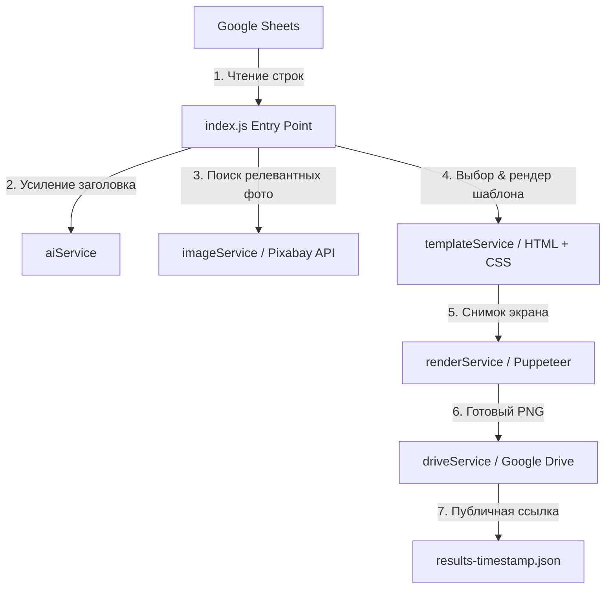

# 📌 Pinterest Pin Generator PROD

Автоматизированная система генерации виральных, высококачественных пинов (инфографики) для Pinterest на основе данных из Google Sheets. Проект использует связку Node.js, Puppeteer (для рендеринга HTML-шаблонов в сверхчеткие изображения), Pixabay API (для автоматического подбора тематических стоковых фото) и Google Drive API (для мгновенной публикации).

---

## 🚀 Основные возможности

*   📊 **Интеграция с Google Sheets:** Автоматическое чтение списков и путеводителей прямо из таблицы Google Таблиц.
*   🖼 **Умный поиск изображений:** Автоматический подбор подходящих вертикальных стоковых фотографий через Pixabay API на основе контекста статьи (например, названия города или достопримечательности).
*   🎨 **Премиальные HTML-шаблоны:** 7 адаптивных стильных шаблонов дизайна пинов (`hero`, `list`, `modern`, `travel-guide`, `where-to-stay`, `beaches`, `itinerary`) с использованием современной типографики, градиентов, эффекта Glassmorphism и сеток.
*   📸 **Сверхчеткий Puppeteer Рендеринг:** Генерация вертикаческих изображений (соотношение сторон 2:3, базовый размер 1000x1500px) с использованием `deviceScaleFactor: 2` для максимальной четкости текста на экранах Retina/Pinterest.
*   ☁ **Загрузка в Google Drive:** Автоматическая отправка сгенерированных пинов на Google Диск с мгновенным получением публичных ссылок для дальнейшего автопостинга.
*   🛠 **Локальный тест-режим (`TEST_MODE`):** Возможность запускать генерацию без подключения к Google Drive, сохраняя результаты локально в папку `./output`.

---

## 🛠 Архитектурный воркфлоу



---

## 📂 Структура проекта

```text
pinterest_prod_full/
├── core/
│   └── pipeline.js          # Основная логика сборки контента, фото и рендеринга вариантов
├── services/
│   ├── aiService.js         # Генерация виральных заголовков (например, "TOP 8 NEW YORK ITINERARY")
│   ├── driveService.js      # Загрузка готовых пинов на Google Drive
│   ├── imageService.js      # Поиск вертикальных и сетчатых фото через Pixabay API
│   ├── renderService.js     # Рендеринг HTML-шаблонов в PNG через Headless Puppeteer
│   ├── sheetsService.js     # Чтение строк и запись статусов в Google Sheets
│   └── templateService.js   # Выбор шаблона и подстановка динамических данных в HTML
├── templates/               # Премиум HTML/CSS шаблоны пинов
│   ├── beaches.html         # Шаблон "Paradise Beaches" с сеткой из 8 фотографий
│   ├── hero.html            # Коллаж из 12 карточек мест с акцентом на "Hero Image"
│   ├── itinerary.html       # Шаблон 3-дневного маршрута с иконками и картой
│   └── where-to-stay.html   # Сравнение 4 районов города для проживания с иконками
├── output/                  # Локальная директория для сохранения сгенерированных картинок и отчетов
├── config.js                # Глобальный конфигурационный файл проекта
├── credentials.json         # Ключи доступа к Google Cloud API (Sheets & Drive)
├── index.js                 # Главный исполняемый скрипт
├── package.json             # Зависимости и скрипты запуска
├── test-hawaii-beaches.js   # Тестовый скрипт для шаблона "beaches" (с мок-данными Pexels)
└── test-nyc-itinerary.js     # Тестовый скрипт для шаблона "itinerary" (с мок-данными Pexels)
```

---

## ⚙️ Настройка и Конфигурация

### 1. Установка зависимостей
Для работы проекта необходима среда [Node.js](https://nodejs.org/) версии 16+. Установите пакеты проекта:
```bash
npm install
```

### 2. Настройка Google API (`credentials.json`)
Для интеграции с Google Sheets и Google Drive вам понадобятся учетные данные Сервисного Аккаунта (Service Account):
1. Перейдите в [Google Cloud Console](https://console.cloud.google.com/).
2. Создайте новый проект, включите **Google Sheets API** и **Google Drive API**.
3. Создайте **Сервисный аккаунт (Service Account)** и скачайте его ключ в формате `JSON`.
4. Переименуйте скачанный файл в `credentials.json` и поместите его в корневую папку проекта.
5. Предоставьте доступ вашему Сервисному аккаунту (его email `your-service-account@...gserviceaccount.com`) на редактирование вашей таблицы Google Sheets и папки Google Drive.

### 3. Конфигурация (`config.js`)
Откройте файл `config.js` и заполните параметры:
```javascript
export const config = {
  width: 1000,         // Ширина пина в пикселях
  height: 1500,        // Высота пина в пикселях (соотношение сторон 2:3)
  outputDir: "./output",
  pixabayApiKey: "ВАШ_PIXABAY_API_KEY", // API ключ от Pixabay для поиска стоковых изображений
  spreadsheetId: "ID_ВАШЕЙ_GOOGLE_ТАБЛИЦЫ", // ID таблицы из адресной строки браузера
  variants: 2          // Количество вариантов пинов, генерируемых для каждой строки таблицы
};
```

---

## 🚀 Инструкция по запуску

### Основной конвейер (Генерация из Google Sheets в Google Drive)
Запуск процесса генерации пинов по строкам таблицы Google Sheets:
```bash
npm start
```
*Этот скрипт прочитает данные, скачает стоковые фото, сгенерирует указанное количество вариантов пинов в папке `./output`, загрузит их на ваш Google Диск и сохранит итоговый отчет в JSON-файл вида `output/results-YYYY-MM-DDTHH-MM-SS.json`.*

### Локальное тестирование (Dry Run / Тестовый режим)
Если вы хотите протестировать генерацию локально без загрузки в Google Диск и без необходимости настройки сервисного аккаунта Google, запустите процесс с переменной среды `TEST_MODE=true`:

**На Windows (PowerShell):**
```powershell
$env:TEST_MODE="true"; npm start
```

**На macOS / Linux:**
```bash
TEST_MODE=true npm start
```

---

## 🧪 Скрипты тестирования шаблонов

Для проверки работы сложной верстки и быстрой генерации пинов без обращений к Google Sheets, в проекте предусмотрены готовые тестовые скрипты с реальными URL стоковых фото:

*   **Тест шаблона пляжей (8 фото на сетке):**
    ```bash
    node test-hawaii-beaches.js
    ```
    *Результат будет сохранен в: `./output/hawaii-beaches-v2.png`*

*   **Тест шаблона детального маршрута (3 дня + иконки + мини-карта):**
    ```bash
    node test-nyc-itinerary.js
    ```
    *Результат будет сохранен в: `./output/nyc-itinerary.png`*

---

## 🎨 Поддерживаемые HTML Шаблоны и их переменные

Каждый шаблон в директории `./templates` содержит переменные вида `{{variableName}}`, которые автоматически заменяются значениями из `pipeline.js` перед рендерингом:

1.  **`itinerary.html` (Маршруты):**
    *   `{{city}}` — Название города (например, "New York").
    *   `{{dayCount}}` — Количество дней.
    *   `{{dayXImage}}` — Фоновые мини-картинки для дней.
    *   `{{dayXTitleY}}`, `{{dayXDescY}}` — Заголовки и описания активностей внутри каждого дня.
2.  **`beaches.html` (Пляжи / Списки):**
    *   `{{bgImage}}` — Общий фоновый рисунок.
    *   `{{titleLine2}}` — Название локации (например, "HAWAII").
    *   `{{image1}}` – `{{image8}}` — Сетка из 8 превью-фото пляжей.
    *   `{{beach1}}` – `{{beach8}}` — Названия пляжей и `{{desc1}}` – `{{desc8}}` — их краткие фишки.
3.  **`where-to-stay.html` (Районы проживания):**
    *   `{{heroImage}}` — Панорамный снимок города.
    *   `{{city}}` — Город.
    *   `{{image1}}` – `{{image4}}` — Снимки 4 рекомендуемых районов.
    *   `{{area1}}` – `{{area4}}` — Названия районов и их особенности/подходит для кого (например, "Best For First Timers").

---

## 📝 Лицензия
Проект поставляется под лицензией MIT. Используйте для автоматизации своего бизнеса и масштабирования трафика в Pinterest!
💡 *Совет: Чтобы пины получались максимально кликабельными, подбирайте контрастные цвета и яркие шрифты в файлах шаблонов в папке `templates/`.*


## PS.
Делал проект по ТЗ, оказалось что компания Alto Media конченная, но проект получился годным, если кому надо то можете забирать. Здесь остается прикрутить ИИшку да и все, и будет красота 
